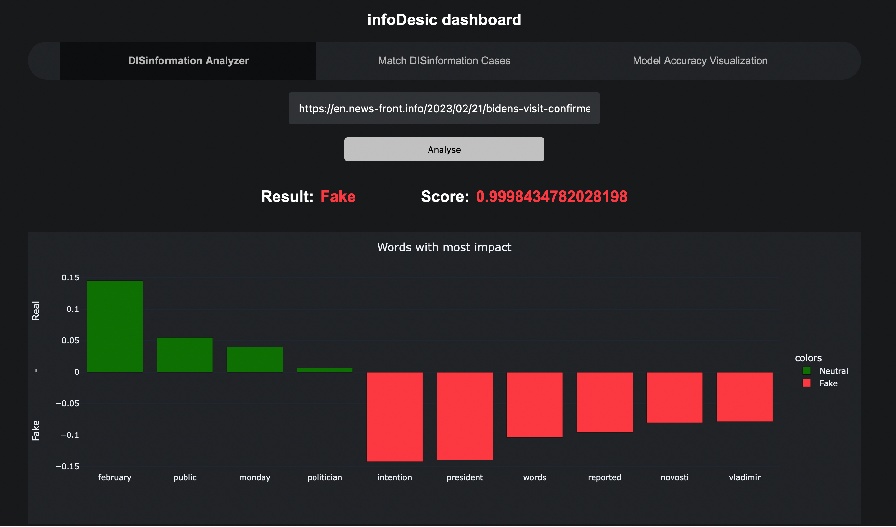
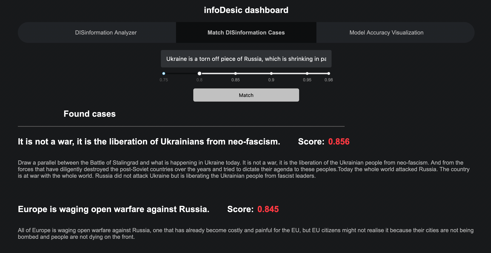
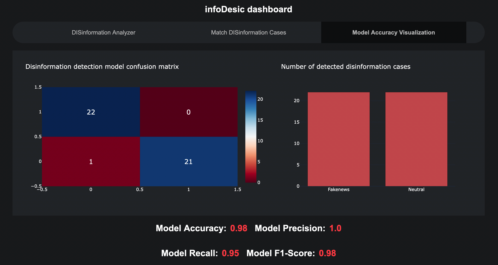
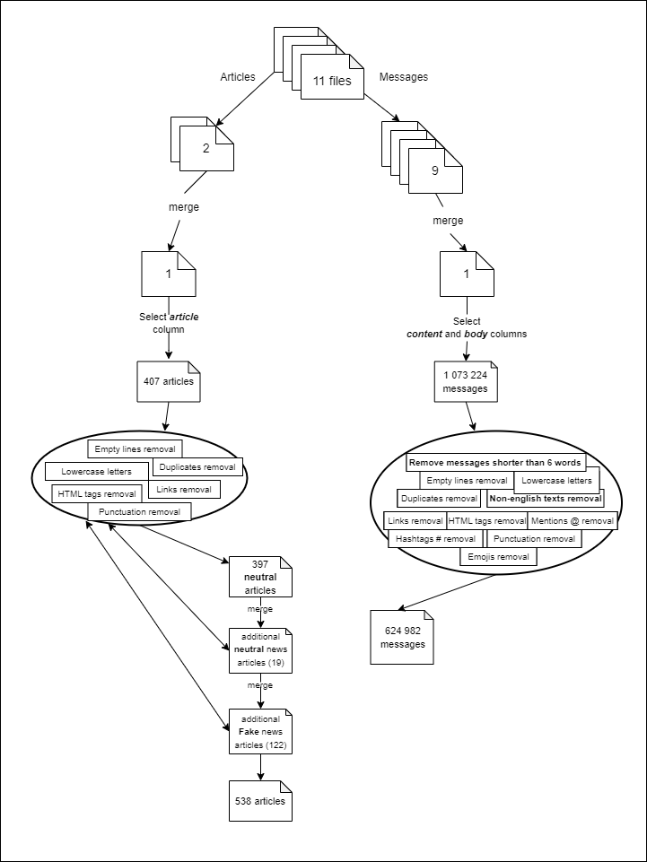

# Team CARD: infoDesic

## Prerequisites
- GNU Make
- Docker
- docker-compose

- Create and activate virtual environment

```
make create-virtualenv
source .venv/bin/activate
```

- Download the model, create folder:
```
src/model_api/models
```
and store the model there with the name: `pytorch_model.bin`.

- Create folder
```
resources
```
and add model testing data there with the name `articles-test.csv`. The format of the .csv file should be the following:

| article         | label    |
| --------------- | -------- |
| Article 1 text  | 0        |
| Article 2 text  | 1        |

where 0 means *disinformation* and 1 means *neutral*.

## Running the program

To deploy the software, in the server terminal run the command:
```
docker-compose up
```

This command will build a composition of docker containers, which make up the disinformation detection tool.

## Dashboard

The main part of the created software is the disinformation dasboard. After running docker-compose, it should be available in the link: http://0.0.0.0/ . 


After you open it, you will see three tabs: Disinformation Analyzer, Match disinformation cases and Model Accuracy visualization. 

The *DISinformation Analyzer* tab lets you paste a url from any news site and it will tell you whether the selected article is classified as fake or neutral. The barchart below will indicate the words which made the most impact to the model, when it classifying text.



The *Match DISinformation Cases* tab lets you paste a social media post or message and check if it is disinformation. The model matches the message to the known disinformation cases and displays the ones that matched. The user can also choose the threshold of the match (the higher the score, the less cases it will match).



The *Model Accuracy Visualization* tab shows you the accuracy of the deep learning model. You can add the test csv file to the `resources` folder, name it `articles-test.csv` and run the `make score-dl-model` command to create you own evaluations. These evaluations will be displayed in this dashboard tab.



## Data Preprocessing step

The data preprocessing was done in the following steps. Two types of data files were preprocessed: articles and social media messages (or posts). After the preprocessing, 538 articles and 624 982 messages were left.



## API documentation

The disinformation detection tool consists of several APIs, which are being used by the infodesic dashboard.

### Desinformation detection API

The desinformation detection API uses a deep learning model to determine if the given article is disinformation. The API is available at: http://127.0.0.1:11111/check_fake/ .

This request requires a json input file. The example json:
```json
{"article_text": "The contents of the article"}
```

The expected result is a dictionary depicting if the article is disinformation and the model explanation information:
```json
{"result": true,
 "explanation": [["war",0.29], ["desinformation",0.16]]}
```

where the `result` field indicated whether the article is disinformation (true) or not (false). The `explanation` field returns a list of words, which influenced the model's solution the most.

### The disinformation cases matching API

The disinformation cases matching API uses a database of known disinformation cases (from https://euvsdisinfo.eu/) and matches the given message to the closest disinformation cases using distance measures and deep learning methods. The API is available at: http://127.0.0.1:22222/match_fake/ .

This request requires a json input file. The example json:
```json
{"message_text": "The contents of the message",
 "threshold": 0.88}
```

The expected result is a list of the closes disinformation cases with their certainty scores and contents:
```json
[{"score": 0.9,
 "title": "The title of the disinformation case",
 "content": "The description of the disinformation case"}]
```

where the `score` field shows the certainty of the method that the given message is the disinformation case, `title` is the title of the disinformation case and `content` is the description of the disinformation case.


### Testing the API

The test file can be found in `tests/test_api.py`. You can run these tests using command: `make run-tests`. If everything is ok, you should see "2 passed" in the output.

### Input query variables

The input query variables have the following types:

- "article_text": str
- "threshold": float
- "message_text": str
